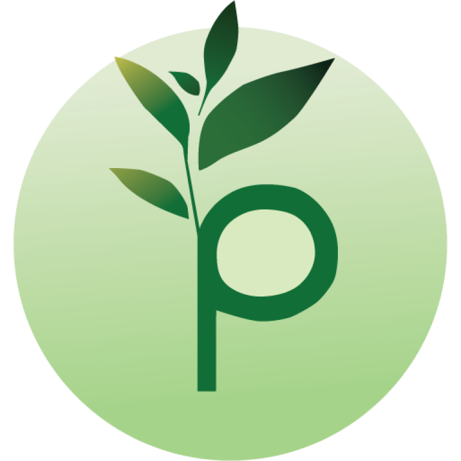

<a id="readme-top"></a>


<!-- PROJECT LOGO -->
<br />
<div align="center">
  <a href="images/PreFarm.png">
    
  </a>

  <h3 align="center">PreFarm</h3>

[![MiT License][license-shield]][license-url]
[![Android][android-shield]][android-url]

  <p align="center">
    Open-source mobile application for crop yields predictions and plant farming probability
    <br />
    <a href="https://github.com/dheovanwa/PreFarm"><strong>Explore the docs »</strong></a>
    <br />
    <br />
    <a href="https://github.com/dheovanwa/PreFarm/issues/new?labels=bug&template=bug-report---.md">Report Bug</a>
    ·
    <a href="https://github.com/dheovanwa/PreFarm/issues/new?labels=enhancement&template=feature-request---.md">Request Feature</a>
  </p>
</div>


<!-- TABLE OF CONTENTS -->
<details>
  <summary>Table of Contents</summary>
  <ol>
    <li>
      <a href="#about-the-project">About The Project</a>
      <ul>
        <li><a href="#built-with">Built With</a></li>
      </ul>
    </li>
    <li>
      <a href="#getting-started">Getting Started</a>
      <ul>
        <li><a href="#prerequisites">Prerequisites</a></li>
        <li><a href="#installation">Installation</a></li>
      </ul>
    </li>
    <li><a href="#contributing">Contributing</a></li>
    <li><a href="#license">License</a></li>
    <li><a href="#contact">Contact</a></li>
    <li><a href="#acknowledgments">Acknowledgments</a></li>
  </ol>
</details>


<!-- ABOUT THE PROJECT -->
## About The Project

This project is created for Artificial Intelligence's Assessment of Learning course at our university. These are the names who built this:
1. [Dheovan Winata Alvian](https://www.linkedin.com/in/dheovan-wa/)
2. Jefferson Darren Cendres 
3. [Jonathan Hopi Pranata](https://www.linkedin.com/in/jonathan-hopi-pranata/)

PreFarm is an app that contains two machine learning model. These are the models:
1. Random Forest Regression: used in predicting the crop yield in units of Hg/Ha.
2. Support Vector Classifier: used in predicting whether a plant can be successfully planted or not.

Why use PreFarm? Here's why:
* Predictability of crop yields can help farmers or big farming companies to predict the biggest yield based on the parameter such as pesticides, rainfall, temperature, etc.
* Successibility of farming plants can help retail to predict whether their plant will grow successfully or not.

<p align="right">(<a href="#readme-top">back to top</a>)</p>


### Built With

This project used python as the machine learning model and backend, and Dart & Flutter as mobile application.

* [![Python][python-shield]][python-url]
* [![Flask][flask-shield]][flask-url]
* [![Dart][dart-shield]][dart-url]
* [![Flutter][flutter-shield]][flutter-url]

<p align="right">(<a href="#readme-top">back to top</a>)</p>


<!-- GETTING STARTED -->
## Getting Started

Make sure you already have the software in prerequisites installed and detectable by your operating system. 

### Prerequisites

You must have these software on your system to run this on anything except android:
* Dart
* Flutter
* Visual Studio Code

or you could just download and install the .apk software from the google drive.

### Installation

_Remember to have the software in prerequisites section already installed._

1. Get openweathermap API Key at [https://openweathermap.org/](https://openweathermap.org/)
2. Clone the repo

   ```sh
   git clone https://github.com/dheovanwa/PreFarm.git
   ```
3. Enter your API key in `lib/data/key.dart`

   ```dart
   const String openweathermapApiKey = YOURAPIKEY;
   ```
4. If you want to install it on your local android phone, then run this on the terminal, make sure it is at the project folder.

    ```sh
    flutter build apk --split-per-abi
    ```
    Or you just want to test it on windows, then just press the run button at the top right corner on visual studio code.

5. The .apk will be available in `build\app\outputs\apk\release`

<p align="right">(<a href="#readme-top">back to top</a>)</p>

<!-- CONTRIBUTING -->
## Contributing

Contributions are what make the open source community such an amazing place to learn, inspire, and create. Any contributions you make are **greatly appreciated**.

If you have a suggestion that would make this better, please fork the repo and create a pull request. You can also simply open an issue with the tag "enhancement".
Don't forget to give the project a star! Thanks again!

1. Fork the Project
2. Create your Feature Branch (`git checkout -b feature/AmazingFeature`)
3. Commit your Changes (`git commit -m 'Add some AmazingFeature'`)
4. Push to the Branch (`git push origin feature/AmazingFeature`)
5. Open a Pull Request

<p align="right">(<a href="#readme-top">back to top</a>)</p>


<!-- LICENSE -->
## License

Distributed under the MIT License. See `LICENSE.txt` for more information.

<p align="right">(<a href="#readme-top">back to top</a>)</p>


<!-- CONTACT -->
## Contact

Dheovan Winata Alvian - [@dheovan.w.a](https://www.instagram.com/dheovan.w.a/) - dheovanwa@gmail.com

Project Link: [https://github.com/dheovanwa/PreFarm](https://github.com/dheovanwa/PreFarm)

<p align="right">(<a href="#readme-top">back to top</a>)</p>


<!-- ACKNOWLEDGMENTS -->
## Acknowledgments

* [Freepik](https://www.freepik.com/)
* [Img Shields](https://shields.io)
* [Ankush Syal - SVG Repo](https://www.svgrepo.com/author/Ankush%20Syal/)
* [Dazzle Line Icon Collection - SVG Repo](https://www.svgrepo.com/collection/dazzle-line-icons/)
* [Basicons - SVG Repo](https://www.svgrepo.com/author/basicons/)
* [Iconpark - SVG Repo](https://www.svgrepo.com/author/IconPark/)
* [Konstantin Filatov - SVG Repo](https://www.svgrepo.com/author/Konstantin%20Filatov/)
* [Saeedworks - SVG Repo](https://www.svgrepo.com/author/Saeedworks/)
* [Scarlab - SVG Repo](https://www.svgrepo.com/author/scarlab/)
* [Solar Icons - SVG Repo](https://www.svgrepo.com/author/Solar%20Icons/)

<p align="right">(<a href="#readme-top">back to top</a>)</p>

<!-- MARKDOWN LINKS & IMAGES -->
[license-shield]: https://img.shields.io/badge/License-MIT-yellow.svg?style=for-the-badge
[license-url]: https://github.com/dheovanwa/PreFarm/blob/main/LICENSE
[android-shield]: https://img.shields.io/badge/Android-3DDC84?style=for-the-badge&logo=Android&logoColor=white
[android-url]: https://drive.google.com/drive/folders/1DVgiwbwA-Kh9QcDIExZ_hEUXLlZE1ha-?usp=drive_link
[python-shield]: https://img.shields.io/badge/Python-3776AB?style=for-the-badge&logo=python&logoColor=fff
[python-url]: https://www.python.org/
[flask-shield]: https://img.shields.io/badge/Flask-000?style=for-the-badge&logo=flask&logoColor=fff
[flask-url]: https://flask.palletsprojects.com/en/stable/
[dart-shield]: https://img.shields.io/badge/Dart-%25230175C2?style=for-the-badge&logo=dart&logoColor=fff&color=0175C2
[dart-url]: https://dart.dev/
[flutter-shield]: https://img.shields.io/badge/Flutter-02569B?style=for-the-badge&logo=flutter&logoColor=fff&color=02569B
[flutter-url]: https://flutter.dev/